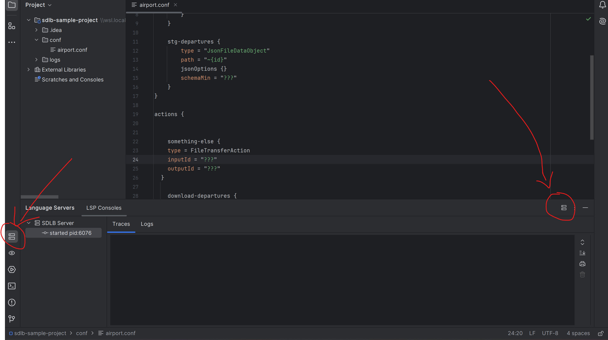
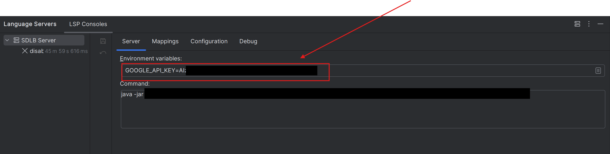

# Smart Data Lake Language Server Protocol (SDL LSP)

[LSP Implementation](https://microsoft.github.io/language-server-protocol/implementors/servers/) for the [Smart Data Lake Builder](https://smartdatalake.ch/) configuration files.

## Description

This LSP server currently provides:

* smart autocompletion suggestions
* Hovering description of objects, their attributes etc.

## How it works

The server communicate with an LSP client, which can be a plugin in a code editor like Intellij, VSCode, Atom etc. or even a web interface.

Standard Input/Output channels are used to communicate with its client, using [JSON-RPC](https://www.jsonrpc.org/specification) protocol.

Usually the client has responsibility to start the server. They first communicate their capabilities and then the client make requests or provide notifications to the server.

## Getting Started

You can either [download](https://oss.sonatype.org/content/repositories/snapshots/io/smartdatalake/sdl-lsp/1.0-SNAPSHOT/) the jar and jump directly to [Setting a basic LSP client in Intellij](#setting-a-basic-lsp-client-in-intellij) or compile and generate the jar yourself.

To download it, go [here](https://oss.sonatype.org/content/repositories/snapshots/io/smartdatalake/sdl-lsp/1.0-SNAPSHOT/) and take the one finishing with `XXX-jar-with-dependencies.jar`.

You can now read [Setting a basic LSP client in Intellij](#setting-a-basic-lsp-client-in-intellij).

If you prefer build the jar, follow the instructions below.

### Dependencies

To be able to build an executable jar with this project, you will need:

* maven
* java 11 or newer

### Installing

* Clone the repo locally.
* run `mvn clean package`

### Setting a basic LSP client in Intellij

* Download the generic LSP support for Intellij using [LSP4IJ](https://plugins.jetbrains.com/plugin/23257-lsp4ij).
* Look for the LSP4iJ icon on your IDE and click on the right and select `New Language Server`. See screnshot below: 
* provide the following parameters:
  * `Server > Name` -> `SDLB Server`
  * `Server > Command` -> `java -jar $PATH_TO_JAR` (see [Getting Started](#getting-started))
  * `Mappings > File name patters` -> click on `+` and then:
    * `File name patterns` -> `*.conf`
    * `Language Id` -> `hocon`
* Click on `ok`. The server should start.

### Setting the custom LSP client in VSCode

Work in progress, should be released soon. Stay tuned!

## LSP Server Configuration

The SDL LSP server behavior can be customized by creating a configuration file at `.sdlb/lsp-config.conf` in your project root. This file allows you to define workspace behavior and AI-assisted features.

### Workspace Configuration

The workspace configuration determines how files are grouped and processed by the LSP server. This is particularly important for features like auto-completion and references that need context from multiple files.

You can choose between four workspace types:

#### 1. RootWorkspace

Creates a new workspace for each direct subfolder of a specified root folder, plus the root folder itself and the root URI.

```hocon
workspaceType = RootWorkspace
workspaceParameters = "conf"
```

**Example structure:**

```plaintext
project/
├── .sdlb/
│   └── lsp-config.conf
├── conf/               # Root folder specified in parameters
│   ├── pipeline1/      # Workspace 1
│   │   ├── extract.conf
│   │   └── transform.conf
│   ├── pipeline2/      # Workspace 2
│   │   ├── extract.conf
│   │   └── load.conf
│   └── common.conf     # Part of root workspace
└── other/
    └── files.txt
```

In this example:

* The `pipeline1` folder and its files form a workspace
* The `pipeline2` folder and its files form another workspace
* The `common.conf` file is in its own workspace
* Files outside the `conf` folder are not included in these workspaces

#### 2. ActiveWorkspace

Creates two workspaces: one "active" workspace containing all files in specified paths, and another workspace for all other files.

```hocon
workspaceType = ActiveWorkspace
workspaceParameters = "conf/local,conf/airport.conf,conf/trainstation.conf"
```

**Example structure:**

```plaintext
project/
├── .sdlb/
│   └── lsp-config.conf
└── conf/
    ├── local/          # Part of active workspace
    │   ├── dev.conf
    │   └── test.conf
    ├── prod/           # Not in active workspace
    │   └── prod.conf
    ├── airport.conf    # Part of active workspace
    ├── trainstation.conf # Part of active workspace
    └── mall.conf       # Not in active workspace
```

In this example:

* The active workspace contains `conf/local/dev.conf`, `conf/local/test.conf`, `conf/airport.conf`, and `conf/trainstation.conf`
* All other files are in a separate workspace

#### 3. SingleWorkspace

All files are included in a single workspace.

```hocon
workspaceType = SingleWorkspace
```

**Example structure:**

```plaintext
project/
├── .sdlb/
│   └── lsp-config.conf
└── conf/
    ├── pipeline1/
    │   └── extract.conf
    ├── pipeline2/
    │   └── load.conf
    └── common.conf
```

In this example, all `.conf` files are in a single workspace, regardless of their location.

#### 4. NoWorkspace

Each file is treated as its own isolated workspace.

```hocon
workspaceType = NoWorkspace
```

**Example structure:**

```plaintext
project/
├── .sdlb/
│   └── lsp-config.conf
└── conf/
    ├── pipeline1/
    │   └── extract.conf  # Isolated workspace
    ├── pipeline2/
    │   └── load.conf     # Isolated workspace
    └── common.conf       # Isolated workspace
```

In this example, each file is in its own workspace and has no awareness of other files.

### AI-Assisted Features

The SDL LSP server includes AI-assisted features to improve code completion and suggestions. To use these features:

1. Obtain a Google API key from [Google AI Studio](https://aistudio.google.com)
2. Configure your LSP client to include the environment variable `GOOGLE_API_KEY` with your API key. See screnshot below: 
3. Optionally customize the AI prompt in your `.sdlb/lsp-config.conf` file

#### Customizing AI Prompts

You can customize how the AI generates suggestions by modifying the prompt in your configuration file:

```hocon
tabStopsPrompt = """You're helping a user with code completion in an IDE.
The user's current file is about a Smart Data Lake Builder configuration, where the "dataObjects" block provides all the data sources
and the "actions" block usually defines a transformation from one or more data sources to another.
Extract a list of suggested tab stops default values.
Tab stops have the following format in the default insert text: ${number:default_value}.
Use the context text to suggest better default values.
Concerning the title of the object, try to infer the intention of the user.
For example, copying from the web to a json could be interpreted as a download action.
Output should be valid JSON with this schema:
[
  {
    "tab_stop_number": number,
    "new_value": string
  }
]

Default insert text:
$insertText

Suggested item is to be inserted in the following HOCON path:
$parentPath

Context text, HOCON format, the user's current file:
$contextText"""
```

This prompt helps the AI understand the context of your Smart Data Lake Builder configuration and provide more relevant suggestions for code completion.

## Authors

[scalathe](https://github.com/dsalathe)

## License

This project is licensed under the GNU General Public License (GPL) version 3 - see the LICENSE.txt file for details
